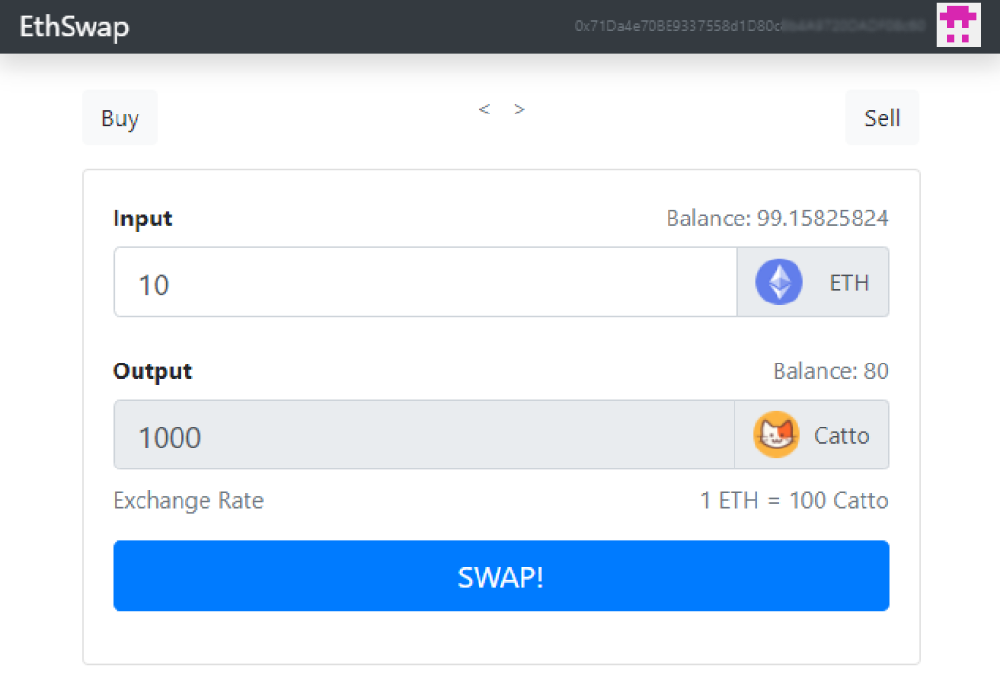
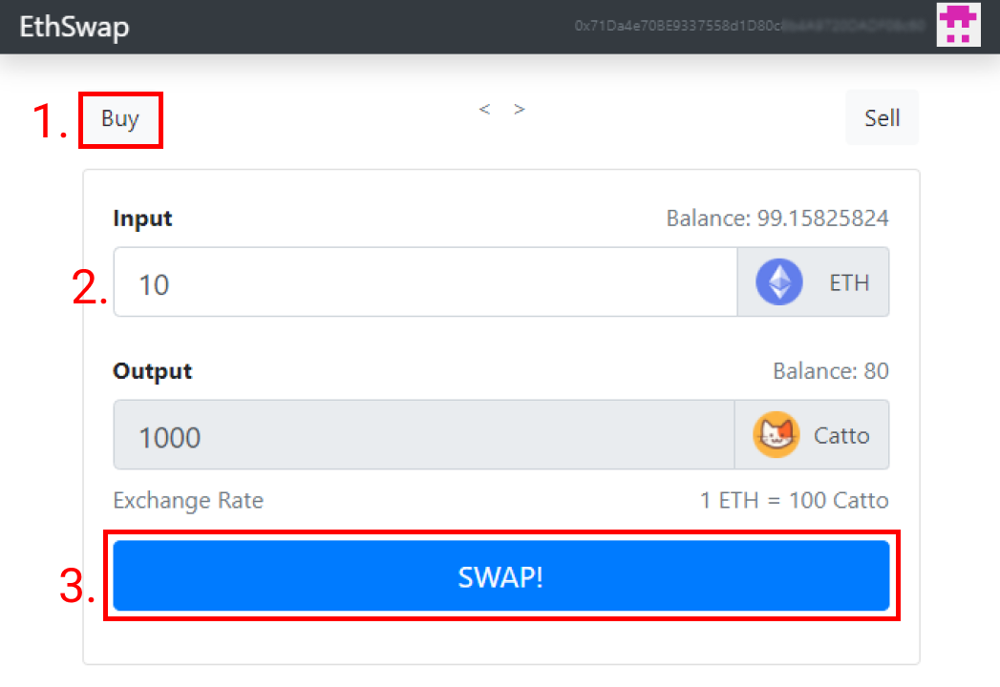
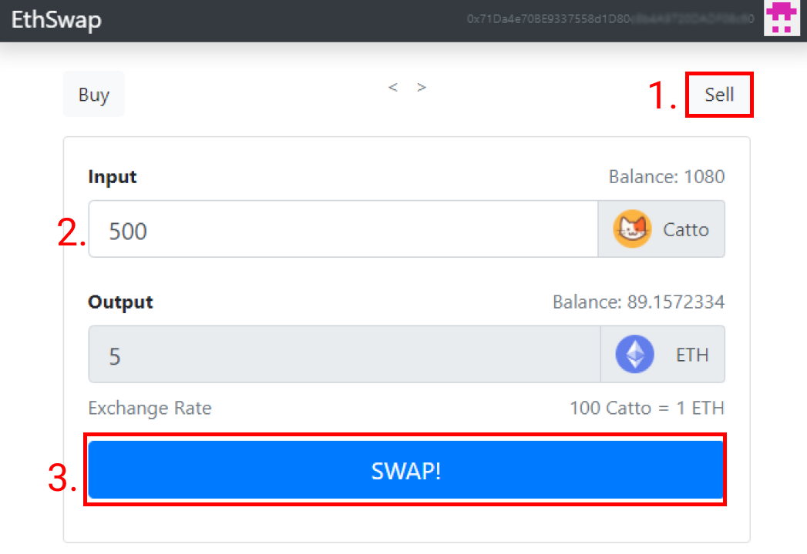

<div id="top"></div>

<!-- TITLE -->
<div align="center">
  <a href="https://github.com/gumastro/dex">
    
  </a>

<h3 align="center">Decentralized Exchange Catto</h3>

  <p align="center">
    Instant decentralized cryptocurrency exchange
    <br />
  </p>
</div>

<!-- TABLE OF CONTENTS -->
<details>
  <summary>Table of Contents</summary>
  <ol>
    <li>
      <a href="#about-the-project">About The Project</a>
      <ul>
        <li><a href="#built-with">Built With</a></li>
      </ul>
    </li>
    <li>
      <a href="#getting-started">Getting Started</a>
      <ul>
        <li><a href="#installation">Installation</a></li>
      </ul>
    </li>
    <li><a href="#usage">Usage</a></li>
    <li><a href="#roadmap">Roadmap</a></li>
    <li><a href="#license">License</a></li>
    <li><a href="#contact">Contact</a></li>
  </ol>
</details>
<br/>

<!-- ABOUT THE PROJECT -->
## About The Project

<br/>&nbsp; 

Instant decentralized cryptocurrency exchange powered by the ethereum blockchain that allows for ERC20 cryptocurrency transactions to take place at a fixed price

<p align="right">(<a href="#top">back to top</a>)</p>

### Built With

* [Solidity](https://docs.soliditylang.org/en/v0.8.12/)
* [web3.js](https://web3js.readthedocs.io/en/v1.7.0/)
* [Truffle](https://trufflesuite.com)
* [Chai.js](https://www.chaijs.com)
* [React.js](https://reactjs.org/)
* [Node.js](https://nodejs.org/en/)

<p align="right">(<a href="#top">back to top</a>)</p>

<!-- GETTING STARTED -->
## Getting Started

### Installation

1. Clone the repo
   ```sh
   git clone https://github.com/gumastro/dex.git
   ```
2. Install NPM packages
   ```sh
   npm install
   ```
3. Open Ganache and run the migrations
    ```sh
    truffle migrate --reset
    ```
4. Start NPM packages
   ```sh
   npm run start
   ```
5. Import an address to Metamask
    * Make sure your Metamask is connected to the right network (same as Ganache test network)
        * RPC URL
        `http://localhost:7545`
        * Chain ID
        `1337`
6. Swap!

<p align="right">(<a href="#top">back to top</a>)</p>

<!-- USAGE EXAMPLES -->
## Usage

### Buy

1. Click on Buy option
2. Select desired amount of Ether to pay
3. Click on Swap!

&nbsp; 


4. Confirm transaction on Metamask pop-up
5. Enjoy your tokens!

### Sell

1. Click on Sell option
2. Select desired amount of Catto to sell
3. Click on Swap!

&nbsp; 

4. Give permission to access your Catto on Metamask pop-up
5. Confirm transaction on Metamask pop-up
6. Enjoy your tokens!

<p align="right">(<a href="#top">back to top</a>)</p>

<!-- TODO -->
## TODO

- [ ] Add fee exchange to collect profit
- [ ] Make exchange rate dynamic
- [ ] Support multiple tokens

<p align="right">(<a href="#top">back to top</a>)</p>

<!-- LICENSE -->
## License

Distributed under the MIT License. See `LICENSE.txt` for more information.

<p align="right">(<a href="#top">back to top</a>)</p>

<!-- CONTACT -->
## Contact

Gustavo Tuani Mastrobuono - gumastro@usp.br

<p align="right">(<a href="#top">back to top</a>)</p>

<!-- MARKDOWN LINKS & IMAGES -->
[dex-catto-screenshot]: imgs/main.png
[buy-catto-screenshot]: imgs/buy.png
[sell-catto-screenshot]: imgs/sell.png